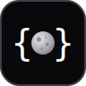

<!-- hero-start -->
<p align="center"></p>
<h1 align="center">Standard Tool</h1>
<p align="center">One type for an LLM tool.<br>Define it once, use it with any provider, SDK, or framework.</p>
<p align="center"><a href="https://standard-tool.js.org">standard-tool.js.org</a></p>
<p align="center">
  <a href="https://github.com/finom/standard-tool/actions/workflows/ci.yml"></a>
  <a href="https://www.npmjs.com/package/standard-tool"></a>
</p>
<!-- hero-end -->

```ts
import type { StandardSchemaV1, StandardJSONSchemaV1 } from '@standard-schema/spec';

interface StandardToolV0<
  Input = unknown, Output = unknown, FormattedOutput = Output, Meta = unknown,
> {
  name: string;
  title?: string; // human label; shown by MCP-style clients in tool lists
  description: string;
  inputSchema?: StandardSchemaV1<Input> & StandardJSONSchemaV1<Input>;
  outputSchema?: StandardSchemaV1<Output> & StandardJSONSchemaV1<Output>;
  execute(input: Input, meta?: Meta): FormattedOutput | Promise<FormattedOutput>;
}
```

That's all of it. It's an **interface, not a library you depend on**: any object of this shape is a StandardTool, so you can conform with a plain object and zero dependencies, the same way Zod, Valibot, and ArkType conform to Standard Schema. Producing a tool takes an object literal; consuming one takes a `try`/`catch`. The npm package is a reference implementation — nothing makes you use it.

The schemas pull double duty: they validate runtime data (a model's arguments are untrusted) and emit JSON Schema for the model via `inputSchema['~standard'].jsonSchema.input({ target })`. Any library implementing both [Standard Schema](https://standardschema.dev) and [Standard JSON Schema](https://standardschema.dev/json-schema) works: Zod 4.2+ and ArkType 2.1.28+ expose it on the schema directly; Valibot via `toStandardJsonSchema()` from `@valibot/to-json-schema` 1.5+.

> **Status: RFC.** `V0` versions the interface, the way `StandardSchemaV1` versions Standard Schema — the shape is settled; a breaking change to it would be `StandardToolV1`. The reference package follows its own `0.x` semver and may still change helper names and the formatting layer. [Critiques and counter-proposals welcome.](https://github.com/finom/standard-tool/issues)

## Why

Every LLM ecosystem ships its own tool object: Vercel AI SDK, MCP, Mastra, Genkit, LangChain, oRPC, Effect. Strip any of them and the same five parts fall out — **d**escription, **i**nput schema, **o**utput schema, **n**ame, **e**xecute; call it **DIONE** — plus a little display metadata. Universal in substance, spelled differently by every framework, portable in none.

The hard part of that list is already solved. [Standard Schema](https://standardschema.dev) unified validation; [Standard JSON Schema](https://standardschema.dev/json-schema) unified JSON Schema emission. Once the schemas cover both jobs, everything left in a tool is two strings and a function.

So the work is backwards. Frameworks keep reinventing the trivial envelope and binding it to their runtime, while the one shared piece gets treated as proprietary. Standard Tool standardizes the envelope too: a ten-line interface, no runtime, no lock-in. [The full survey is below.](#how-it-compares)

## Writing a tool

Two ways to the same shape.

**With the type.** Any object of the shape is a StandardTool — no builder, no runtime; validation is yours to place:

```ts
import { z } from 'zod'; // or arktype, or valibot + @valibot/to-json-schema
import type { StandardToolV0 } from 'standard-tool'; // types-only — or paste the interface above

const getWeather: StandardToolV0<{ city: string }, { tempC: number }> = {
  name: 'get_weather',
  description: 'Current temperature for a city',
  inputSchema: z.object({ city: z.string() }),
  outputSchema: z.object({ tempC: z.number() }),
  execute: async ({ city }) => ({ tempC: 21 }),
};

// JSON Schema for the model (empty object when the tool takes no input):
const parameters = getWeather.inputSchema?.['~standard'].jsonSchema
  .input({ target: 'draft-2020-12' }) ?? { type: 'object', properties: {} };
```

**With the builder.** Same fields through the reference `standardTool()` — a model's args are untrusted, so it wires the validation into `execute`:

```sh
npm i standard-tool
```

```ts
import { standardTool } from 'standard-tool';

const getWeather = standardTool({
  name: 'get_weather',
  description: 'Current temperature for a city',
  inputSchema: z.object({ city: z.string() }),
  outputSchema: z.object({ tempC: z.number() }),
  execute: async ({ city }) => ({ tempC: 21 }),
});

// { tempC: 21 } — validated in & out; throws StandardToolValidationError on a violation
await getWeather.execute({ city: 'Paris' });
```

Prefer not to depend on the package at all? [Copy-paste the ~90-line source.](#copy-paste-the-source)

## Formatting the result

A plain tool returns its `Output` and throws on failure. That's right for typed code, but inside a model loop you usually want a failure to come back as *data* the model can correct from, and some consumers (MCP) want a specific result envelope. The contract already covers this — `execute` throws — so any consumer turns failure into data with a bare `try`/`catch` and zero imports:

```ts
let result: unknown;
try { result = await tool.execute(args); }
catch (e) { result = { error: e instanceof Error ? e.message : String(e) }; }
```

`withFormattedOutput()` is this, written once, with types — it wraps a tool without touching `Input` or `Output`. Take the builder-made `getWeather`:

```ts
// throws StandardToolValidationError
await getWeather.execute({ city: 123 } as never);
// returns { error: 'input validation failed: …' }
await withFormattedOutput(getWeather).execute({ city: 123 } as never);
```

It takes any `(result: Output | Error) => FormattedOutput`. The formatter gets the validated `Output` on success and an `Error` on failure (a `StandardToolValidationError` carrying `target` and the Standard Schema `issues`); with no formatter it uses the default `{ error }` envelope. The formatter runs exactly once per call, and what *it* throws propagates unformatted — so it can rethrow errors that belong to the app rather than the model. The formatter's return type becomes the third generic:

```ts
const asText = withFormattedOutput(getWeather, (r) =>
  r instanceof Error ? `error: ${r.message}` : `${r.tempC}°C`,
);
await asText.execute({ city: 'Paris' }); // '21°C'
```

Formatting is the **consumer's last step, applied once at its own boundary**: ship and share tools neutral (`FormattedOutput = Output`), and let each consumer re-target the same tool for itself. `withFormattedOutput` accepts only neutral tools, so formatting an already-formatted tool is a type error rather than a stacked envelope.

Frameworks that ship their own formatting hook — `toModelOutput` in the [AI SDK](https://ai-sdk.dev/docs/reference/ai-sdk-core/tool), [Mastra](https://mastra.ai/reference/tools/create-tool), and [VoltAgent](https://voltagent.dev/docs/agents/tools/) — don't need this: hand them the neutral tool and format inside their hook. `withFormattedOutput` is for consumers without one: raw provider loops, hand-rolled MCP servers.

## Per-call context (`meta`)

`execute` takes an optional second argument, `meta`. It's never validated and never in the JSON Schema. Use it for a locale, an auth token, a request-scoped DB handle: the tool stays defined once at module scope while you inject context at call time.

Annotate `meta` on the handler and the type propagates to every caller:

```ts
const greet = standardTool({
  name: 'greet',
  description: 'Greet a person in the caller-supplied locale',
  inputSchema: z.object({ name: z.string() }),
  execute: ({ name }, meta: { locale: string }) =>
    meta.locale === 'fr' ? `bonjour ${name}` : `hi ${name}`,
});

await greet.execute({ name: 'Ada' }, { locale: 'fr' }); // 'bonjour Ada'
// compile error: Meta is { locale: string }
await greet.execute({ name: 'Ada' }, { locale: 7 });
```

## Using it with any provider

One array of tools, wired into OpenAI, Anthropic, the Vercel AI SDK, and MCP. Two parts do the work everywhere:

- `inputSchema['~standard'].jsonSchema.input({ target })` is the JSON Schema you hand the model.
- `execute(args)` runs the call. Inside a loop, turn a throw into `{ error }` data so the model can self-correct — a bare `try`/`catch`, or `withFormattedOutput(tool).execute(args)` as the examples below do.

Examples use Zod; the model only ever sees emitted JSON Schema, so ArkType and Valibot produce identical calls — ArkType the same way as Zod, Valibot by wrapping each schema in `toStandardJsonSchema()` from `@valibot/to-json-schema`. They assume you've installed the relevant provider SDK.

### The tools

Built with the reference `standardTool()` so `execute` validates in and out; a plain `StandardToolV0` object wires up identically — validation is then yours to place.

```ts
// tools.ts
import { standardTool, type StandardToolV0 } from 'standard-tool';
import { z } from 'zod';

export const tools: StandardToolV0[] = [
  standardTool({
    name: 'get_weather',
    description: 'Get the current temperature for a city.',
    inputSchema: z.object({ city: z.string() }),
    outputSchema: z.object({ tempC: z.number() }),
    execute: async ({ city }) => ({ tempC: 21 }),
  }),
  standardTool({
    name: 'get_time',
    description: 'Get the current time in an IANA timezone.',
    inputSchema: z.object({ timezone: z.string() }),
    outputSchema: z.object({ iso: z.string() }),
    execute: async ({ timezone }) =>
      ({ iso: new Date().toLocaleString('en-US', { timeZone: timezone }) }),
  }),
  standardTool({
    name: 'convert_currency',
    description: 'Convert an amount between two currencies.',
    inputSchema: z.object({ amount: z.number(), from: z.string(), to: z.string() }),
    outputSchema: z.object({ amount: z.number() }),
    execute: async ({ amount }) => ({ amount: Math.round(amount * 1.08 * 100) / 100 }),
  }),
];
```

### OpenAI

Tool calls arrive as `function_call` items in `res.output`; results go back as `function_call_output`.

```ts
import OpenAI from 'openai';
import { withFormattedOutput } from 'standard-tool';
import { tools } from './tools';

const client = new OpenAI();
const input: OpenAI.Responses.ResponseInput = [
  { role: 'user', content: 'What is the weather in Paris?' },
];

const res = await client.responses.create({
  model: 'gpt-5.5',
  input,
  tools: tools.map((tool): OpenAI.Responses.Tool => ({
    type: 'function',
    name: tool.name,
    description: tool.description,
    parameters: tool.inputSchema?.['~standard'].jsonSchema
      .input({ target: 'draft-2020-12' }) ?? { type: 'object', properties: {} },
    strict: false,
  })),
});

input.push(...res.output);
for (const item of res.output) {
  if (item.type !== 'function_call') continue;
  const tool = tools.find((t) => t.name === item.name);
  if (!tool) continue;
  const result = await withFormattedOutput(tool).execute(JSON.parse(item.arguments));
  input.push({
    type: 'function_call_output',
    call_id: item.call_id,
    output: JSON.stringify(result),
  });
}

const final = await client.responses.create({ model: 'gpt-5.5', input });
console.log(final.output_text);
```

Chat Completions is the same idea with a different envelope: tools nest under a `function` key, calls come back on `message.tool_calls`, and each result is a `role: 'tool'` message.

### Anthropic

The Messages API uses `input_schema`, returns `tool_use` blocks in the assistant message, and expects `tool_result` blocks in the next user message.

```ts
import Anthropic from '@anthropic-ai/sdk';
import { withFormattedOutput } from 'standard-tool';
import { tools } from './tools';

const client = new Anthropic();
const messages: Anthropic.MessageParam[] = [
  { role: 'user', content: 'What is the weather in Paris?' },
];

const res = await client.messages.create({
  model: 'claude-sonnet-4-6',
  max_tokens: 1024,
  messages,
  tools: tools.map((tool): Anthropic.Tool => ({
    name: tool.name,
    description: tool.description,
    input_schema: (tool.inputSchema?.['~standard'].jsonSchema
      .input({ target: 'draft-2020-12' }) ??
      { type: 'object', properties: {} }) as Anthropic.Tool.InputSchema,
  })),
});

messages.push({ role: 'assistant', content: res.content });
const results: Anthropic.ToolResultBlockParam[] = [];
for (const block of res.content) {
  if (block.type !== 'tool_use') continue;
  const tool = tools.find((t) => t.name === block.name);
  if (!tool) continue;
  const result = await withFormattedOutput(tool).execute(block.input);
  results.push({
    type: 'tool_result',
    tool_use_id: block.id,
    content: JSON.stringify(result),
  });
}
messages.push({ role: 'user', content: results });

const final = await client.messages.create({
  model: 'claude-sonnet-4-6',
  max_tokens: 1024,
  messages,
});
console.log(final.content.flatMap((b) => (b.type === 'text' ? [b.text] : [])).join(''));
```

### Vercel AI SDK

The AI SDK (v6) runs the loop itself. Its `tool()` accepts a Standard Schema directly, so pass `inputSchema` as-is and hand it `execute`:

```ts
import { generateText, tool, stepCountIs } from 'ai';
import { openai } from '@ai-sdk/openai';
import { tools } from './tools';

const { text } = await generateText({
  model: openai('gpt-5.5'),
  prompt: 'What is the weather in Paris?',
  stopWhen: stepCountIs(5),
  tools: Object.fromEntries(
    tools.map(({ name, description, inputSchema, execute }) => [
      name,
      tool({ description, inputSchema, execute }),
    ]),
  ),
});

console.log(text);
```

The SDK validates input; these built tools re-check it (cheap) and add the output validation the SDK skips — input guards your code from the model, output guards the model from your code. A result that fails `outputSchema` means `execute` is broken, so it throws instead of feeding the model garbage; to skip the re-check, hand the SDK your own handler.

### MCP

An [MCP](https://modelcontextprotocol.io) tool returns a result envelope, `{ content, structuredContent?, isError? }`, and a descriptor whose schemas are JSON Schema. Both come from the same two parts: `jsonSchema.input()` for the descriptor, and a `withFormattedOutput(tool, toMcpResult)` formatter that maps `execute`'s result onto the envelope.

The formatter below is text-only: an object becomes a JSON text block mirrored into `structuredContent` (per MCP's [back-compat guidance](https://modelcontextprotocol.io/specification/2025-06-18/server/tools#structured-content)), and errors return `isError: true` so the model can self-correct. Image, audio, and resource blocks are out of scope.

```ts
import { withFormattedOutput } from 'standard-tool';
import { tools } from './tools';

type McpToolResult = {
  content: { type: 'text'; text: string }[];
  structuredContent?: Record<string, unknown>;
  isError?: boolean;
};

const toMcpResult = (result: unknown): McpToolResult => {
  if (result instanceof Error)
    return { content: [{ type: 'text', text: result.message }], isError: true };
  if (typeof result === 'string') return { content: [{ type: 'text', text: result }] };
  const text = JSON.stringify(result);
  if (result !== null && typeof result === 'object' && !Array.isArray(result)) {
    return {
      content: [{ type: 'text', text }],
      structuredContent: result as Record<string, unknown>,
    };
  }
  return { content: [{ type: 'text', text }] };
};

const mcpTools = tools.map((t) => withFormattedOutput(t, toMcpResult));

// tools/list — emit the descriptor's JSON Schema directly
const descriptors = mcpTools.map((t) => ({
  name: t.name,
  title: t.title,
  description: t.description,
  inputSchema: t.inputSchema?.['~standard'].jsonSchema
    .input({ target: 'draft-2020-12' }) ?? { type: 'object', properties: {} },
}));

// tools/call — execute validates once, then returns the MCP result shape
async function call(name: string, args: unknown) {
  const tool = mcpTools.find((t) => t.name === name);
  if (!tool) throw new Error(`Unknown tool: ${name}`);
  // → { content: [{ type: 'text', text: '{"tempC":21}' }],
  //     structuredContent: { tempC: 21 } }
  return tool.execute(args);
}
```

### Testing

No model, no framework. Data in, data out:

```ts
import { withFormattedOutput } from 'standard-tool';
import { tools } from './tools';

const getWeather = tools.find((t) => t.name === 'get_weather')!;

expect(await getWeather.execute({ city: 'Paris' })).toEqual({ tempC: 21 });
await expect(getWeather.execute({ city: 123 as never })).rejects.toThrow();
expect(await withFormattedOutput(getWeather).execute({ city: 123 as never }))
  .toMatchObject({ error: expect.any(String) });
```

### Notes

- **Who validates.** OpenAI and Anthropic don't check arguments against your schema — the tool's schemas are the only line of validation, so run them on the model's raw args. In the examples that happens inside the built tools' `execute`; `withFormattedOutput` only turns the throw into data. The AI SDK validates input against `inputSchema`, but not `execute`'s output — its `outputSchema` is types-only.
- **Bad JSON.** `JSON.parse` runs before `execute`, so guard it if the model might emit invalid JSON syntax; that throws before `execute` can turn a failure into `{ error }`.
- **JSON Schema targets.** `draft-2020-12` fits OpenAI and Anthropic; use `openapi-3.0` for the OpenAPI subset (Gemini), or `draft-07`.

## Beyond LLM tools

"LLM tool" is the obvious use, but the shape is really a **self-describing function**: a callable bundled with everything needed to understand it without running it: a stable `name`, a `description`, and typed `inputSchema`/`outputSchema` that both validate and emit JSON Schema. A model is one consumer that happens to need exactly that bundle. The same bundle drives others:

- **prompt construction** — tell a model what it can call
- **documentation** — `name` + `description` + schemas → reference docs
- **UI / forms** — `inputSchema` → a typed form
- **command palettes / CLIs** — a tool is a described command with typed args
- **RPC / endpoints** — `name` + schemas + `execute` is a procedure

Describing a tool needs only its metadata, so the docs and prompt uses read `name`/`description`/schemas without ever calling `execute`.

> [!NOTE]
> That opens a use this hasn't had a clean shape for: **portable tools as ordinary library exports.** A library closes auth and config over each `StandardToolV0` and ships them as a client — `new OrdersClient(...)` gives you `client.getOrders`, a member that both runs and self-describes, so a model or framework picks it up with no extra wiring:

```ts
// in the library: members are StandardTools, auth closed over at construction
class OrdersClient {
  constructor(private auth: { apiKey: string }) {}

  getOrders = standardTool({
    name: 'get_orders',
    description: "List a user's orders",
    inputSchema: z.object({ userId: z.string() }),
    execute: ({ userId }) => { /* …hit the API with this.auth… */ },
  });
}

// in the consumer
const client = new OrdersClient({ apiKey: '…' });
await client.getOrders.execute({ userId: 'u_1' }); // run it
await withFormattedOutput(client.getOrders).execute({ userId: 'u_1' }); // → to a model
client.getOrders.description; // self-describing
```

Alternatively, when the bare function should stay directly callable, hang the tool off it as a property — `getOrders` is the function, `getOrders.tool` the descriptor:

```ts
export async function getOrders(input: { userId: string }) { /* …hit the API… */ }
getOrders.tool = standardTool({
  name: 'get_orders',
  description: "List a user's orders",
  inputSchema: z.object({ userId: z.string() }),
  execute: getOrders,
});

await getOrders({ userId: 'u_1' }); // call it directly
await withFormattedOutput(getOrders.tool).execute({ userId: 'u_1' }); // → to a model
```

It ships like any other library code: a value your caller imports and runs. MCP, by contrast, is a protocol — you stand up a server to speak it. How you build the tool stays idiomatic per library (a class, a factory, a bare export); only the result is fixed — every member is a `StandardToolV0`.

## Copy-paste the source

Don't want `standard-tool` in your dependency list? Own the ~90 lines. Paste this and pull the spec types from the types-only [`@standard-schema/spec`](https://github.com/standard-schema/standard-schema) (`npm i -D @standard-schema/spec`) — same logic as the published package, with the vendored interfaces swapped for that import. (You still bring a Standard Schema library for the schemas themselves, exactly as with the package.)

```ts
import type { StandardSchemaV1, StandardJSONSchemaV1 } from '@standard-schema/spec';

/** Portable LLM tool. The type fixes the shape, not where validation runs; ship it neutral, format at the consumer boundary. */
export interface StandardToolV0<Input = unknown, Output = unknown, FormattedOutput = Output, Meta = unknown> {
  name: string;
  title?: string;
  description: string;
  inputSchema?: StandardSchemaV1<Input> & StandardJSONSchemaV1<Input>;
  outputSchema?: StandardSchemaV1<Output> & StandardJSONSchemaV1<Output>;
  execute(input: Input, meta?: Meta): FormattedOutput | Promise<FormattedOutput>;
}

/** Takes a tool whose `execute` is the raw handler; returns one whose `execute` validates in & out. */
export function standardTool<Input = unknown, Output = unknown, Meta = unknown>(
  def: StandardToolV0<Input, Output, Output, Meta>
): StandardToolV0<Input, Output, Output, Meta> {
  const { execute: handler, ...rest } = def;
  return {
    ...rest,
    execute: async (input: Input, meta?: Meta): Promise<Output> => {
      const value = def.inputSchema ? await validate('input', def.inputSchema, input) : input;
      const output = await handler(value, meta);
      return def.outputSchema ? await validate('output', def.outputSchema, output) : output;
    },
  };
}

/**
 * Wrap a neutral tool so failures come back as data instead of throws.
 * Apply once, at the consumer's boundary. The formatter runs exactly once; what it throws propagates unformatted.
 */
export function withFormattedOutput<Input, Output, FormattedOutput = Output | { error: string }, Meta = unknown>(
  tool: StandardToolV0<Input, Output, Output, Meta>,
  format?: (result: Output | Error) => FormattedOutput | Promise<FormattedOutput>
): StandardToolV0<Input, Output, FormattedOutput, Meta> {
  const fmt = (format ?? ((r: Output | Error) => (r instanceof Error ? { error: r.message } : r))) as (
    result: Output | Error
  ) => FormattedOutput | Promise<FormattedOutput>;
  return {
    ...tool,
    execute: async (input: Input, meta?: Meta): Promise<FormattedOutput> => {
      let result: Output | Error;
      try {
        result = await tool.execute(input, meta);
      } catch (error) {
        result = error instanceof Error ? error : new Error(String(error));
      }
      return fmt(result);
    },
  };
}

/** Thrown when input or output fails validation; carries the side and the Standard Schema issues. */
export class StandardToolValidationError extends Error {
  readonly name = 'StandardToolValidationError';
  constructor(
    readonly target: 'input' | 'output',
    readonly issues: readonly StandardSchemaV1.Issue[]
  ) {
    super(
      `${target} validation failed: ${issues
        .map((i) => {
          const at = (i.path ?? []).map((s) => String(typeof s === 'object' ? s.key : s)).join('.');
          return at ? `${at}: ${i.message}` : i.message;
        })
        .join('; ')}`
    );
  }
}

async function validate<S extends StandardSchemaV1>(
  target: 'input' | 'output',
  schema: S,
  value: unknown
): Promise<StandardSchemaV1.InferOutput<S>> {
  const result = await schema['~standard'].validate(value);
  if (result.issues) throw new StandardToolValidationError(target, result.issues);
  return result.value;
}
```

## The interface

`StandardToolV0` (top of this README) is the contract — program against the type. `standardTool()` is the reference builder that produces a conforming value; adapt another library's tool to the type and it works just as well.

| field | type | purpose |
| --- | --- | --- |
| `name` | `string` | identifier the model emits |
| `description` | `string` | what the tool does |
| `title?` | `string` | human label for MCP-style tool lists; ignored by plain function-calling APIs |
| `inputSchema?` | `StandardSchemaV1<Input> & StandardJSONSchemaV1<Input>` | validates and emits JSON Schema |
| `outputSchema?` | `StandardSchemaV1<Output> & StandardJSONSchemaV1<Output>` | validates and emits JSON Schema |
| `execute` | `(input: Input, meta?: Meta) => FormattedOutput \| Promise<FormattedOutput>` | runs the tool; input untrusted until checked against `inputSchema`; may throw |

The field table is just [DIONE](#why) with types — `title` is the metadata slot. And yes, the moon in the logo is Saturn's Dione.

`Input` and `Output` are inferred from the schemas, or from `execute` when a schema is omitted. With no `inputSchema`, `Input` stays `unknown` and the input passes through unvalidated. A tool that takes nothing can either omit the schema — the examples then send `{ type: 'object', properties: {} }` on the wire — or declare `z.object({})`, which consumers like the AI SDK (where `inputSchema` is required) need anyway. Schemas are optional; when present they must implement both Standard Schema and Standard JSON Schema — Zod 4.2+ and ArkType 2.1.28+ directly, Valibot via `toStandardJsonSchema()` from `@valibot/to-json-schema` 1.5+.

The interface fixes the shape, not where validation runs: validate inside `execute` (as the reference builder does) or leave it to the consumer. The reference helpers:

```ts
// validates in & out, throws on a violation
standardTool(def): StandardToolV0<Input, Output>;
// opt into a consumer-specific result — apply once, at your own boundary
withFormattedOutput(tool, format?): StandardToolV0<Input, Output, F>;
```

`standardTool()` takes a `StandardToolV0` whose `execute` is your raw handler and returns one whose `execute` validates. `withFormattedOutput(tool, format?)` wraps a neutral tool so failures become data instead of throws. The thrown `StandardToolValidationError` carries `target: 'input' | 'output'` and the Standard Schema `issues`.

## How it compares

The claim in [Why](#why) is that every ecosystem reinvents the envelope while the schema layer underneath is already standardized. The evidence:

**Every tool is the same six things.**

| Concern | What it is | Who consumes it |
| --- | --- | --- |
| name | stable identifier the model emits | the model |
| description | natural-language "what / when to use" | the model |
| input schema | parameter shape, as JSON Schema | the model (to emit args), your code (to validate) |
| output schema | result shape | your code, some clients (MCP) |
| execute | the function that runs | your runtime |
| metadata | title, annotations, hints | clients / UIs |

The two schemas carry all the complexity, because each serves two masters: emit JSON Schema (so a model can call the tool) and validate runtime data (because a model's arguments are untrusted). Everything else is a string or a function.

**The wire formats have converged on JSON-Schema parameters but disagree on the wrapper and dialect.** OpenAI uses `parameters` (with a `strict` mode that constrains the schema); Anthropic uses `input_schema`; MCP uses `inputSchema` plus `outputSchema`; Gemini uses `functionDeclarations` and accepts only an OpenAPI-3.0 subset. Same data, four shapes.

**The framework objects are where it gets worse.** Each invents its own object and welds it to its own runtime:

| Ecosystem | params key | output schema | execute | schema source | standalone? |
| --- | --- | --- | --- | --- | --- |
| OpenAI / Anthropic / Gemini | `parameters` / `input_schema` | n/a | you wire it | JSON Schema (dialects vary) | wire format only |
| MCP | `inputSchema` | `outputSchema` | server handler | JSON Schema | wire format only |
| Vercel AI SDK | `inputSchema` | `outputSchema` | `execute` | Zod / JSON Schema | needs `ai` |
| Mastra | `inputSchema` | `outputSchema` | `execute` | Standard JSON Schema | needs `@mastra/core` |
| Genkit | `inputSchema` | `outputSchema` | fn | Zod | needs a live `genkit()` |
| LangChain | `schema` | n/a | fn | Zod / inferred | needs `@langchain/core` |
| **Standard Tool** | `inputSchema` | `outputSchema` | `execute` | Standard (JSON) Schema | **plain object, zero deps** |

The columns are nearly identical; the objects are mutually incompatible, and none is obtainable on its own. There's no `createTool` without `@mastra/core`, no `defineTool` without a live `genkit()` instance, no `tool()` without `ai` or `@langchain/core`. So "just reuse framework X's tool" means adopting framework X. The neutral, zero-dependency slot is empty. (Mastra already builds its schemas on Standard JSON Schema, so the foundation is shared; only the envelope isn't.)

**The schema layer, by contrast, is solved.** [Standard Schema](https://standardschema.dev) is a ~60-line interface co-designed by the authors of Zod, Valibot, and ArkType, already consumed by tRPC and TanStack; it unifies validation. [Standard JSON Schema](https://standardschema.dev/json-schema) adds emission, with the dialect selectable per call (`target` spans multiple JSON Schema standards) and zero runtime dependencies. Validation and emission are both handled and dependency-free to consume. The envelope is the easy part, and it's the part that's still missing. That inversion is what Standard Tool answers.

## The case against

- **Adoption** ([XKCD 927](https://xkcd.com/927/)). A shape nobody else produces or consumes is just a tidy wrapper for its author, and that's roughly where this sits today. The bet: the shape is obvious enough to make adapters trivial, and Standard Schema already showed a neutral interface can spread by adoption rather than mandate. There's no runtime and no lock-in, so the surface to "win" is small, but it's still one more shape on the pile until others pick it up. This is the honest weak point.
- **Why not extend an existing primitive?** Mastra's `createTool` and the AI SDK's `tool()` are the closest prior art, but each is bundled inside a framework and returns a framework-coupled value. The neutral slot is empty; this exists to make it concrete enough to argue about.
- **`outputSchema` is rarely consumed.** Most provider APIs ignore output schemas; only MCP-style clients validate them. Today it earns its place through your own runtime safety and docs, not the model.

## Scope

Not an agent runtime (no loop, plan, or model call), not a model client (no HTTP), not a transport (MCP serves tools over a wire; this shapes them in memory), not a schema library (it consumes Standard Schema), not an orchestrator (no registries, retries, routing). Bring your own.

## Links

- [Standard Schema](https://standardschema.dev) · [Standard JSON Schema](https://standardschema.dev/json-schema) · [`@standard-schema/spec`](https://github.com/standard-schema/standard-schema)
- [OpenAI function calling](https://developers.openai.com/api/docs/guides/function-calling) · [Anthropic tool use](https://platform.claude.com/docs/en/build-with-claude/tool-use) · [Gemini function calling](https://ai.google.dev/gemini-api/docs/function-calling) · [MCP tools](https://modelcontextprotocol.io/specification/2025-06-18/server/tools)
- [Vercel AI SDK `tool()`](https://ai-sdk.dev/docs/reference/ai-sdk-core/tool) · [Mastra `createTool`](https://mastra.ai/reference/tools/create-tool) · [Genkit](https://genkit.dev/docs/tool-calling/) · [LangChain](https://www.npmjs.com/package/@langchain/core)

## License

MIT © Andrey Gubanov
